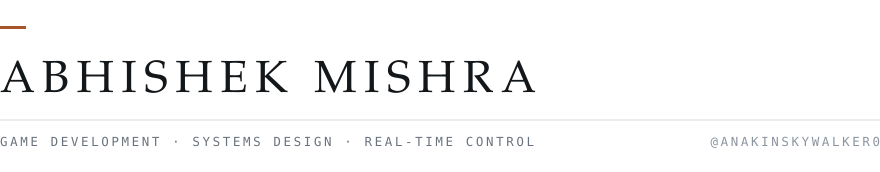

<picture>
  <source media="(prefers-color-scheme: dark)" srcset="assets/header-dark.svg">
  
</picture>

I work on real-time AI for games and robotics: boss behaviour, character controllers,
and control systems that turn a decision into motion within a frame budget. Unreal
and Unity, C++ and C# for performance-critical code, Python for the inference side.

<picture>
  <source media="(prefers-color-scheme: dark)" srcset="assets/cat-dark.svg">
  
</picture>

An adaptive boss AI stack for Unreal Engine. It runs local real-time inference to
read player behaviour, detect combat patterns, and rewrite the boss's tactics
mid-fight. Instead of cycling scripted phases, the encounter learns what you keep
doing and starts countering it.

&nbsp;&nbsp;→ [Combat-Adaptation-Transformer](https://github.com/AnakinSkywalker0/Combat-Adaptation-Transformer) &nbsp;·&nbsp; `C++` `Unreal`

<br>

<picture>
  <source media="(prefers-color-scheme: dark)" srcset="assets/arc-dark.svg">
  
</picture>

A language model can plan but has no model of what the hardware it's directing can
physically do. A learned policy is fast and precise but has no reasoning about
goals. Reflex Arc pairs an LLM planner with a trained control policy and runs the
result on a rover navigating a classroom-sized Mars testbed.

I build the layer between them — translating the planner's output into motor
commands, and keeping the rover moving if the network connection drops.

&nbsp;&nbsp;→ [IshuIsAwake/reflex-arc](https://github.com/IshuIsAwake/reflex-arc) &nbsp;·&nbsp; `Python` `RL` `hardware`

## Smaller pieces

[**Dragon Arena Battle**](https://github.com/AnakinSkywalker0/DragonArenaBattle) — a 2.5D
arena in Unity 6.3, player against an FSM-driven dragon with fire, tail and flight.
Two hours, start to polish, kept as a clean record of how it was built.<br>
[**Node Based Dialogue System**](https://github.com/AnakinSkywalker0/NodeBasedDialogueSystem) — branching
dialogue authored on a graph, built on Unity's own GraphView API rather than a plugin.<br>
[**Morse Input**](https://github.com/AnakinSkywalker0/Morse_input_unity) — timing-detection
logic that reads Morse from key presses and maps it onto game actions. `J` for jump.<br>
[**Emotiv EPOC X × Unity**](https://github.com/AnakinSkywalker0/Emotiv-Epoc-X-Unity-test-) — an
EEG headset wired into a Unity scene, to find out what an unreliable input channel
does to game feel.

## Toolkit

```
engines    Unreal · Unity
languages  C++ · C# · Python
adjacent   Blender · real-time inference · reinforcement learning
```

---

<sub>[All repositories](https://github.com/AnakinSkywalker0?tab=repositories)</sub>
